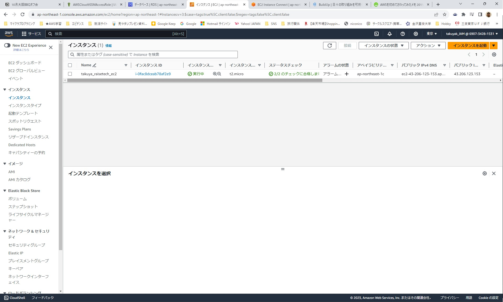
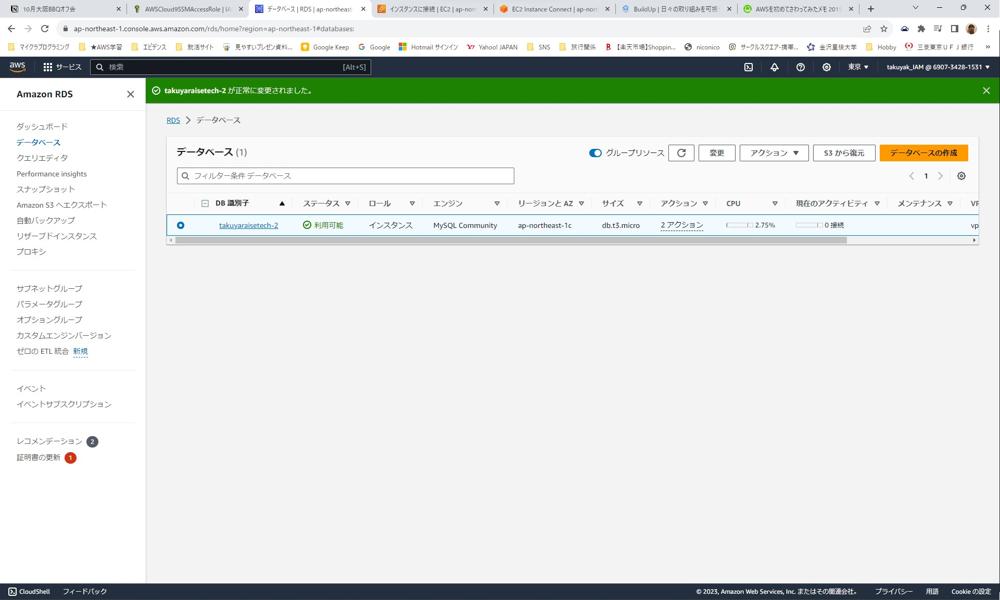
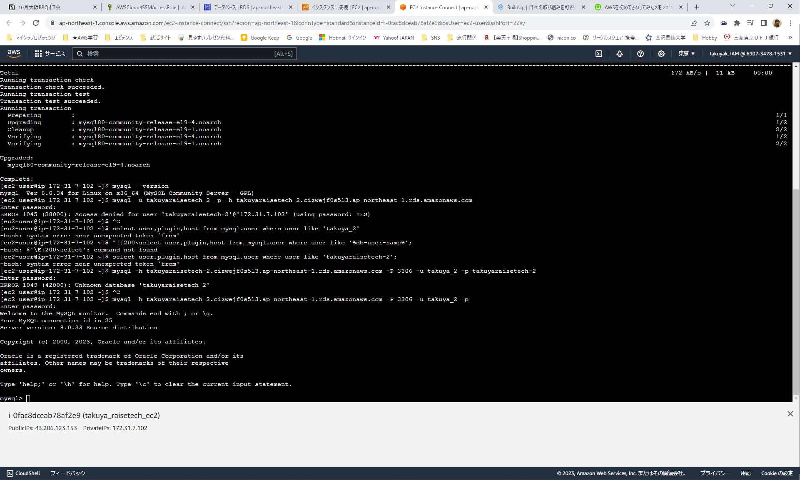
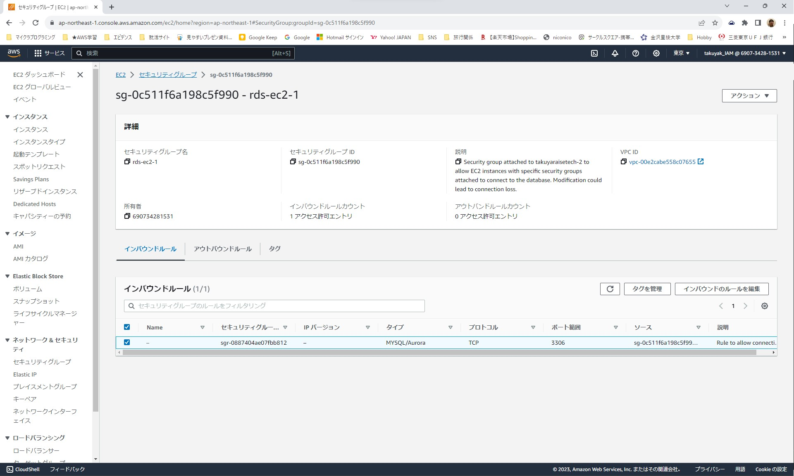
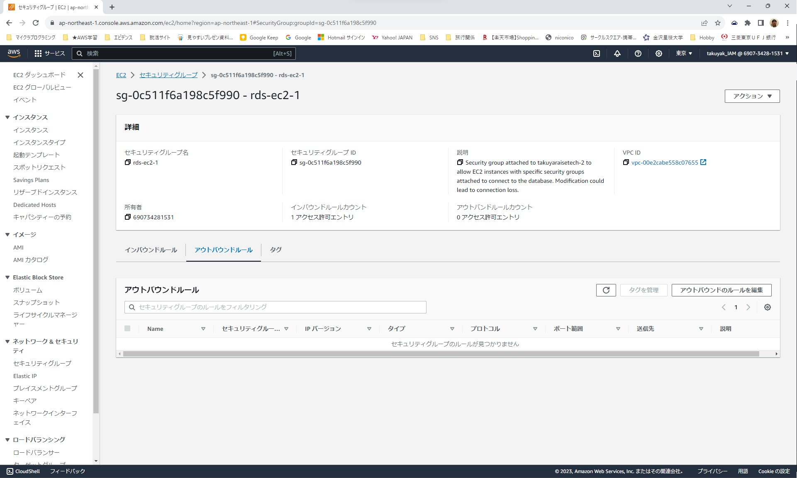
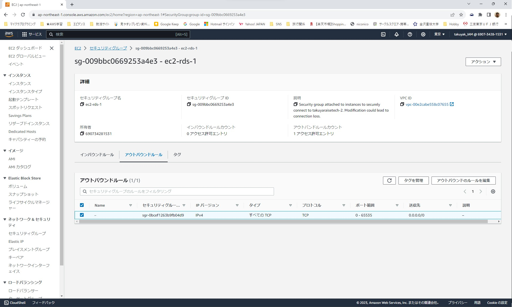
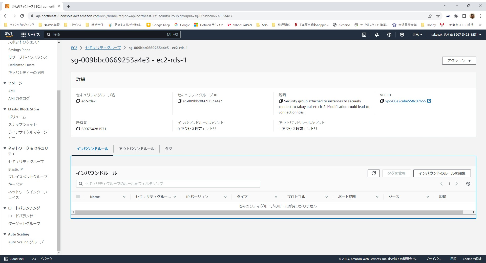
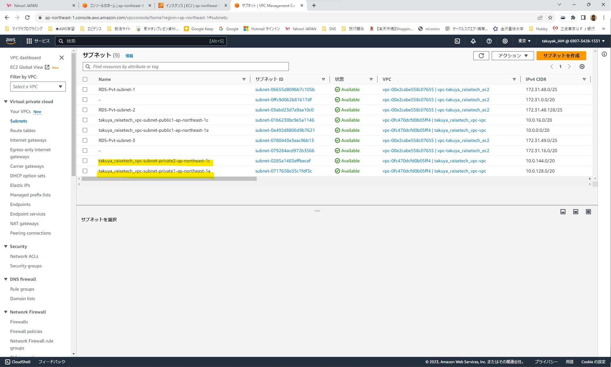
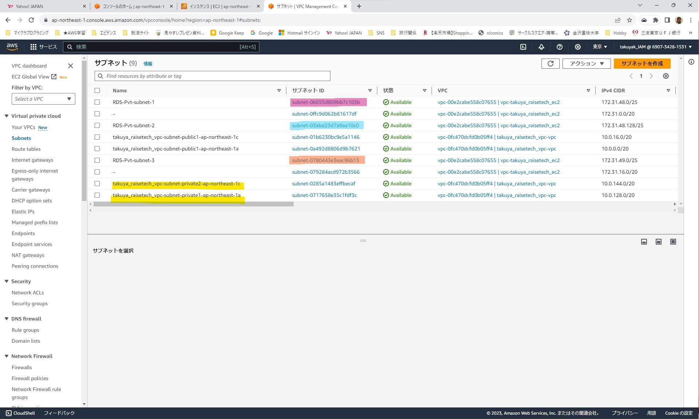

# 第4回課題

- EC2作成完了した画面
    
    

- RDS作成完了した画面
    

    

- EC2よりRDS（MySQL）へ接続成功した画面
    

    

- セキュリティグループの設定内容
    
    
    RDS→EC2のセキュリティグループ
    

    
    
    
    
    EC2→RDSのセキュリティグループ
    
    
    
    
    
    - セキュリティグループのec2-rds-1のアウトバウンドルールにポート3306を開放するように設定。
    
        - （RDSへのデータ読み書きは、EC2が司令して行うので、EC2から外向きの通信に対して、セキュリティグループで許可してあげる必要がある。
    
            セキュリティグループの特性上、EC2から外向きに行った通信（アウトバウンド）の返信は、逆向きの通信（インバウンド）に関係なく通信が許可される。これを”ステートフル”と言う。）

- RDSがプライベートサブネットに配置される設定になっていること

